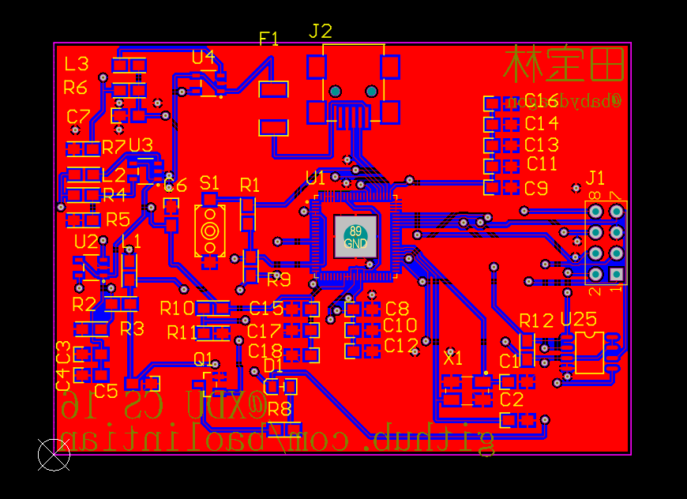
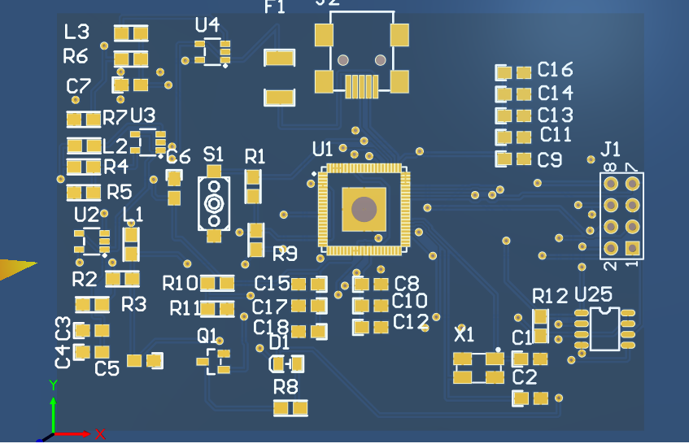
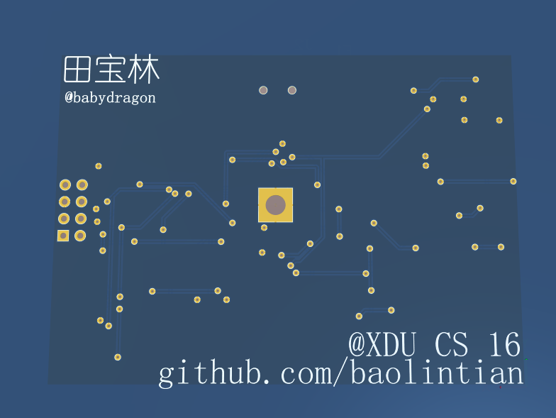

## DIY_card

从零开始的Linux卡片机制作。

## preface

最近看了很多DIY Linux卡片机的视频，__哪个男孩没有DIY Linux卡片机的梦想__？于是，本着好奇+强烈的DIY欲望，找到了诸多的B站上的分享展示视频，却发现很少有人去教具体的DIY过程，仅仅是很粗略的展示了最后做出来的结果。

于是，又是一番搜索，发现了这样的一个项目：[linux bussiness card](https://github.com/thirtythreeforty/businesscard-linux)

花了一点时间读了这个作者的项目，还是非常的详细的，包括原理图，甚至有详细的教学的博客。这也是我能够找到较为完整的Linux卡片机制作的开源资料（实际上在后面的制作的过程中，发现并不是最完整的，有一个stem32的最小系统，哭）。

但是美中不足的就是，这个项目作者表示自己画的线很挫，不愿意共享PCB文件。兄弟们，这问题就很大啊，我一个纯软件开发的小白要从零开始画PCB？

## PCB绘制

本来是不想自己画的，但是好像我在群里问的大佬，淘宝都不给力，无奈只能自己画了。

首先，我们需要参考`bussinesscard.pdf`这个文件。

使用Altium Designer设计软件。

学习使用的教程：[PCB绘制极速入门--基于STM32最小系统板的设计](https://www.bilibili.com/video/BV1xE411T75E) 教程讲的非常的详细。

绘制PCB的过程：

1. 导入相关的库文件，如原理图库，PCB库。

2. 首先是参照pdf文件画相应的原理图，这里只要注意引脚的逻辑关系就行了。并且将相应的逻辑关系进行连接。

3. 在原理图中添加相应的封装，这里封装就代表了逻辑符号和现实中元件引脚的映射，如果没有的话可以试试到立创EDA中找找。（上面的这三步就表示原理图画好了，下面进入PCB板的绘制）
4. 将原理图update到PCB板中，调整相应的constraint，ignore元件内部的限制
5. 尽心元件的布局，先放主要的芯片，电容电阻参考原理图的位置进行摆放
6. 进行布线，不要使用auto route，自己慢慢布线，注意先连重要的通路。
7. 敷铜，使得系统能够有更好的电气信号，铜一般连GND

这样PCB就画好了。在嘉立创上进行打板，在立创上购买相应的元器件，有些比较罕见的器件需要到淘宝上购买

## 结果

## 其他

B站上有一个很火的视频[【自制】技术宅UP耗时三个月，自制B站最强小电视！【极度硬核】【3分钟从草图到实物】](https://www.bilibili.com/video/BV1jE41137eu) 

通过这个小小的绘制PCB板的过程，其实发现自制Linux卡片机并不是很难，应该说甚至是一个物联网本科生或者计算机嵌入式方向的必备基本功，可以看到视频中Altium Designer画 PCB 部分展示的是画线，这应该没什么难度。。。不过这个 UP 还是厉害，从设计图纸完全自制了一个这样的卡片机，但是远远没有想象中的那么厉害。

才到嘉立创去打板，后续还有很多的工作没做。。。当然还有很多要改进的地方，比如USB换成斜插的扁平式USB

## 未完待续。。。

